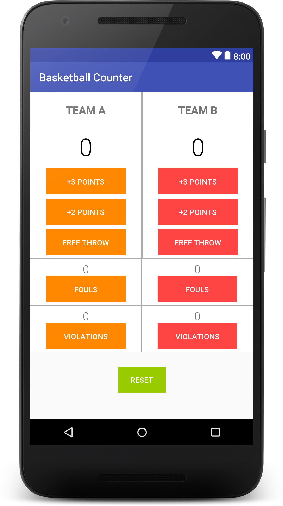
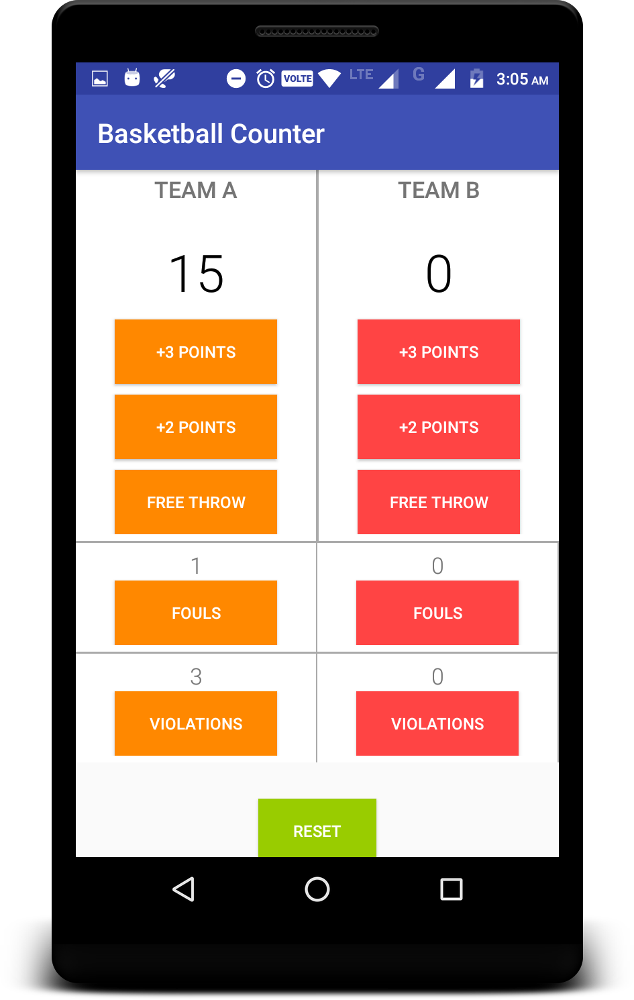
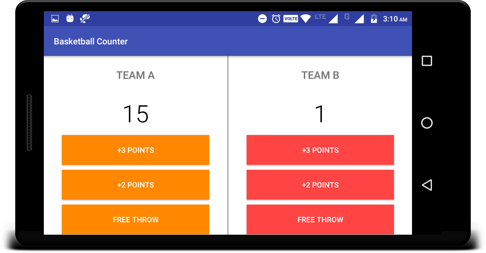

# Score-Keeper-App
Project which comes under Udacity Android Basics Nanodegree Program

# Project Overview
This project is a chance for you to combine and practice everything you learned in this section of the Nanodegree program. You will be making an app that allows a user to keep track of points within a game.

The goal is to create an Score Keeper app which gives a user the ability to keep track of the score of two different teams playing a game of your choice. To build this project, you can follow along with the practice set and customize the Court Counter app to track scores from a different sport.

# What will I learn?
-Adding button code to your app
-Updating views
-Properly scoping variables
-Finding views by their ID

## Final Output - Screenshots

Screen 1                          |Screen2                          |Screen 3                                                  
:--------------------------------:|:--------------------------------:|:--------------------------------:
                  |                 |                  

